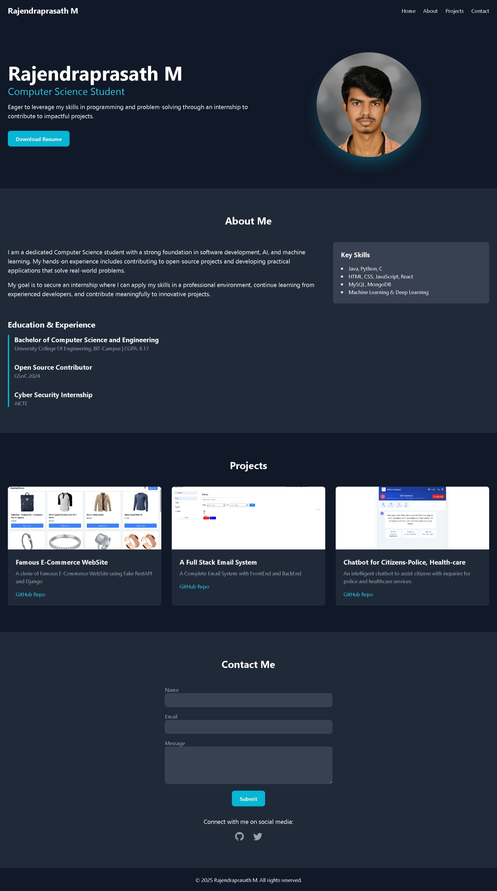
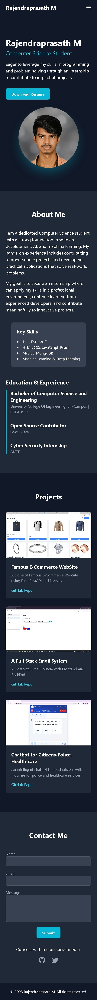

# Personal Portfolio Website

This is a personal portfolio website created using only HTML and Tailwind CSS. The purpose of this project is to serve as a professional online presence to showcase my skills, projects, and experience to potential employers and collaborators.

## Features

*   **Four Sections:** The website includes four main sections: Home, About, Projects, and Contact.
*   **Fully Responsive:** The layout is designed to be fully responsive and looks great on all devices, from mobile phones to desktops.
*   **Modern UI/UX:** The design follows good UI/UX practices, with a clean and modern aesthetic.
*   **Smooth Scrolling:** The navigation bar uses anchor links for smooth scrolling between sections.
*   **Interactive Elements:** The project cards have hover effects to enhance user experience.

## Building Experience

Building this portfolio website was a great exercise in solidifying my understanding of HTML and Tailwind CSS. I focused on creating a clean and well-structured layout using semantic HTML tags. Tailwind CSS's utility-first approach allowed me to rapidly build and style the components without writing any custom CSS.

The most challenging yet rewarding part was ensuring the website was fully responsive across different screen sizes. I extensively used Tailwind's responsive design features, like `md:` and `lg:` prefixes, to tailor the layout for various devices.

Overall, this project has been a valuable experience in creating a modern and professional-looking website from scratch using a minimalist and efficient tech stack.

## How to Run

1.  Clone this repository or download the zip file.
2.  Open the `index.html` file in your web browser.

---

### **Screenshots**

#### Desktop View

#### Mobile View
